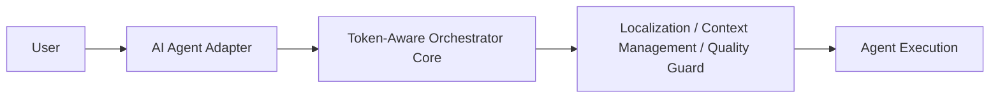

# Token-Aware Orchestrator

Make AI agents read less, not think less.

`v0.4.0-alpha`

Token-Aware Orchestrator is an **AI Agent Context Optimization Layer**.

It helps AI coding agents reduce unnecessary context reads so higher-capability models can spend tokens on high-value reasoning.

## Problem

AI coding agents are powerful, but they waste context reading irrelevant information.

Without context optimization, large amounts of history and unrelated files are repeatedly sent into tasks, causing:

- inflated token spend,
- weaker long-horizon focus,
- and unnecessary handoff noise.

## Solution

- **Precise Localization**: route each task to the most relevant files/components only.
- **Context Optimization**: apply candidate selection and context reduction before execution.
- **Thread Protection**: protect execution with circuit-breaker controls and fallback behavior.
- **State Persistence**: keep task context and progress safely persisted.
- **Quality Verification**: keep tests and validation in the loop.

## Agent Compatibility

Designed to be agent-agnostic.

### Current

- OpenAI Codex

### Future adapters (planned)

- Claude Code
- Gemini CLI
- Grok-related coding workflows
- Cursor
- Other popular AI coding agents

Core architecture is separated from agent adapters.

## Benchmark

- Task success: `5/5`
- Tests: `5/5`
- Context reduction: `~75.9%`
- Unexpected changes: `0`
- Token data: **estimated**

## Architecture Diagram



## Install

```bash
cd /path/to/token-aware-orchestrator-v0-3-1
python3 scripts/orchestratorctl.py install
```

The installer also generates a default config at:

- `~/.config/token-aware-orchestrator/config.yaml`

If needed, add `~/.local/bin` to PATH:

```bash
export PATH="$HOME/.local/bin:$PATH"
```

## Use

```bash
token-aware-orchestrator status
token-aware-orchestrator report
```

Run the orchestrated workflow with your existing agent runtime as normal for your target stack.

## Limitations

- Local Worker is optional and may fall back to direct execution.
- `token_data` is estimated unless a future real token source is integrated.
- Not a replacement for the underlying agent; it is a context optimization layer.
- macOS is the default supported platform.
- No GUI, no cloud service, no user account system, and no paid model management in this release.

